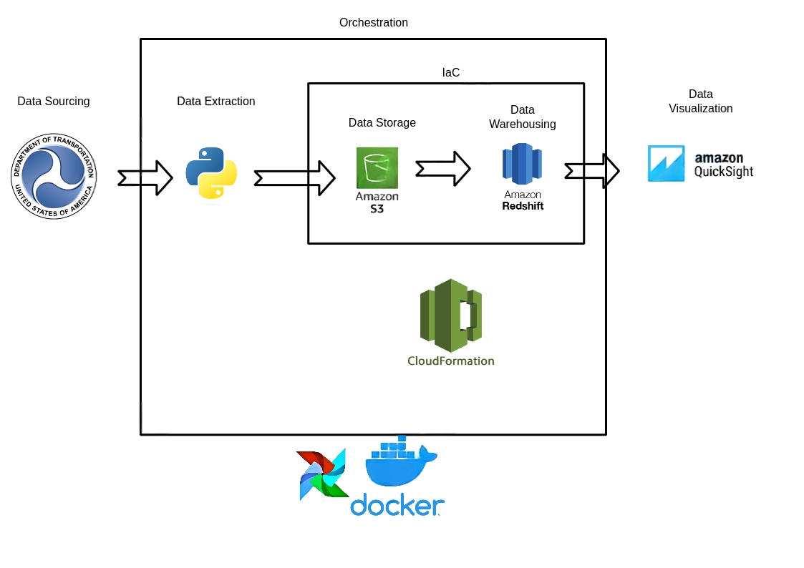
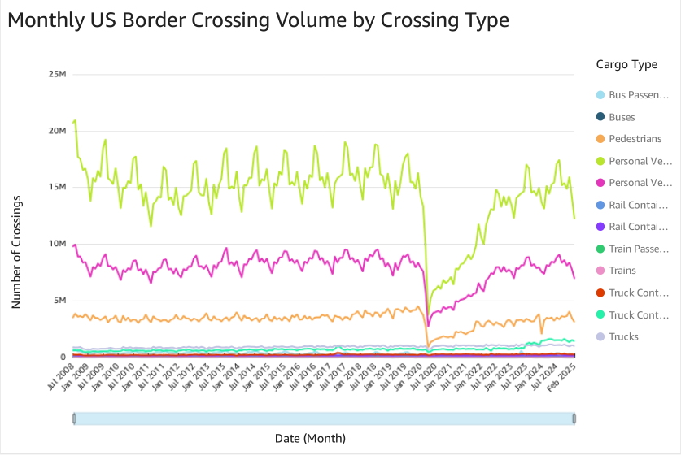
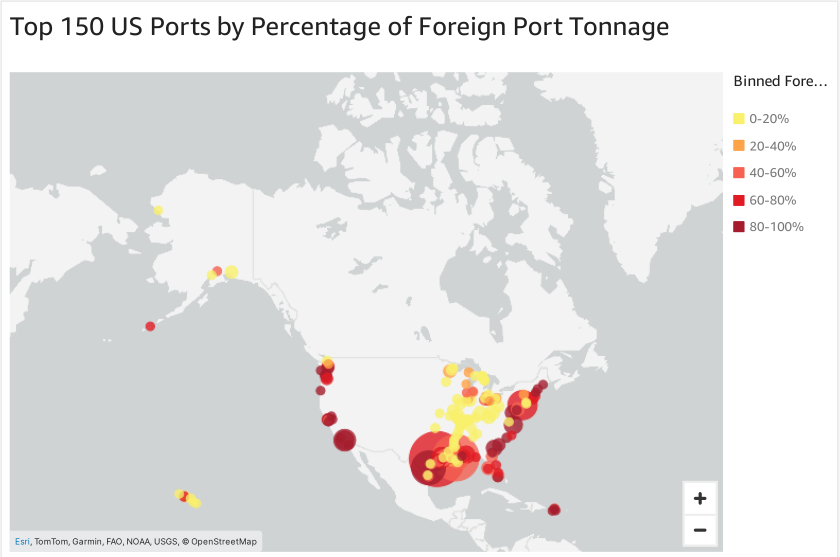

# US Border Crossing Insights

In light of recent changes to US policy surrounding trade and international travel, it is important to document who may be affected and how. This repository contains the code and resources for analyzing US border crossing and port traffic data. The project utilizes Dockerized Apache Airflow for orchestrating ETL pipelines, Amazon S3 for storing raw data, Amazon Redshift for data warehousing, and Amazon Quicksight for dashboarding.

---

## Table of Contents

1. Project Overview
2. Data Pipeline Architecture
3. Repository Structure
4. Setup Instructions
5. How to Run the Project

---

## Project Overview

The **US Border Crossing Insights** project aims to provide insights into the changing nature US border crossings and port activity. The process produces visualizations which aim to answer these two questions:
1. How is the movement of people and goods into the US being affected?
2. Which ports are most vulnerable to decreases in imported goods?

---

## Data Pipeline Architecture

The project uses the following architecture:

1. **Data Source**: Raw data is ingested from the U.S. Department of Transportation's Bureau of Transportation Statistics
2. **ETL Orchestration**: Apache Airflow, deployed via Docker container, orchestrates the ETL process.
3. **Data Loading**: Python scripts execute the ingestion of raw datasets into S3 for further refinement.
4. **Data Transformation**: SQL scripts executed by Airflow transform raw data into structured tables in Redshift.
5. **Data Warehouse**: Amazon Redshift serves as the data warehouse for storing transformed data.

See  for visualization
---

## Repository Structure

```plaintext
us-border-crossing-insights/
├── airflow/
│   ├── dags/
│   │   ├── sql/
│   │   │   ├── transform_tables.sql  # SQL transformations for Redshift
│   │   ├── border_crossing_dag.py    # Airflow DAG definition
├── images/                           # Images used in the README
│   ├── Monthly_crossings_by_type.png # onthly crossings by type
│   ├── Ports_by_foreign_tonnage.png  # Ports by foreign tonnage
│   ├── Architecture_Flow.jpeg        # Architecture used in the project
├── [README.md]                       # Project documentation
├── requirements.txt                  # Python dependencies
├── cloudformation.yaml               # AWS CloudFormation template for infrastructure
```
---

## Setup Instructions

### Prerequisites
A machine with the following software installed:
- Python (I used 3.12)
- Docker
- Docker Compose
- AWS CLI

An AWS account with the following permissions policies:
- AmazonEC2FullAccess
- AmazonRedshiftFullAccess
- AmazonS3FullAccess
- IAMFullAccess
- SecretsManagerReadWrite
- CloudformationFullAccess

AWS credentials saved in ~/.aws/credentials

### Setup

1. Clone the repository:
   ```bash
   git clone https://github.com/your-username/us-border-crossing-insights.git
   cd us-border-crossing-insights
   ```

2. Install dependencies:
   ```bash
   pip install -r requirements.txt
   ```

3. Set up Cloudformation stack
   ```bash
   # replace <my_stack> with a unique name
   aws cloudformation create-stack --stack-name <my_stack> --template-body file://cloudformation.yaml 
   # note - some resources (e.g. S3 bucket name) may need to be altered to ensure uniqueness
   ```

---

## How to Run the Project

1. Execute Docker functions to build images and attach to containers
   ```bash
   docker compose up -b
   ```

2. Trigger the DAG:
   - Open the Airflow UI at `http://localhost:8080`.
   - Trigger the `border_crossing_dag`.

3. Monitor the pipeline:
   - Check the DAG's progress in the Airflow UI.
   - Verify the transformed tables in Redshift.

4. Connect to Quicksight:
    - Connect the `port_tonnage` and `port_monthly_traffic` Redshift datasets to Quicksight 
    - Recreate the dashboards seen here
     
    and linked [here](https://us-east-1.quicksight.aws.amazon.com/sn/account/zoomcamp/dashboards/165e08b2-de82-427f-9727-b2676695d19a/sheets/165e08b2-de82-427f-9727-b2676695d19a_b703f637-e760-43c3-97c6-49a14d254452)

---
